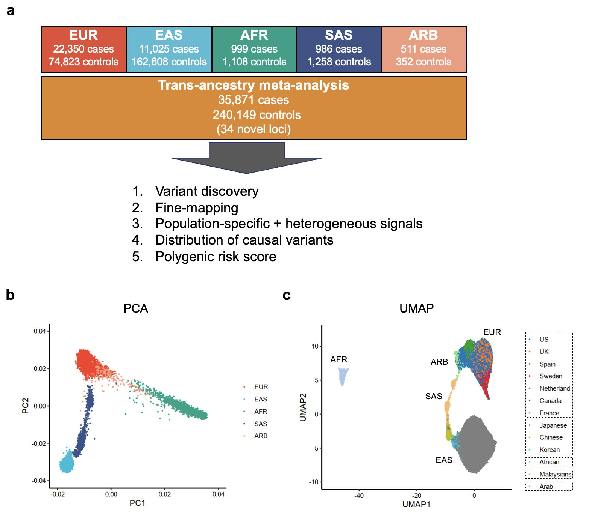

# Overview
We conducted a large-scale genome-wide association study (GWAS) of rheumatoid arthritis (RA) which includes 276,020 samples of five ancestral groups. We included 37 cohorts comprising 35,871 RA patients and 240,149 control individuals of EUR, EAS, AFR, SAS, and ARB ancestry (Figure 1a). PCA and UMAP analysis confirmed that participants included representation of many of the 1KG Phase 3 ancestries.

**Reference: Ishigaki K et al. Trans-ancestry genome-wide association study identifies novel genetic mechanisms in rheumatoid arthritis. MedRxiv 2021 (in prep.)**


## Main findings
- We identified 124 significant loci, of which 34 were novel.
- Trans-ethnic fine mapping identified putatively causal variants with biological insights (e.g., LEF1) and less than ten 95% credible sets at 43 loci.
- Candidate genes at the novel loci suggested essential roles of the immune system (e.g., TNIP2 and TNFRSF11A) and joint tissues (e.g., WISP1) in RA etiology.
- PRS based on trans-ancestry GWAS outperformed PRS based on single-ancestry GWAS and had a comparable performance between European and East Asian populations. 



**Figure 1. Diverse ancestral background in this GWAS participants.**
(a) Study design of this GWAS. 
(b) PCA plot of all GWAS samples. 
(c) UMAP plots of all GWAS samples. 

## The summary statistics and the best PRS model are available at the following link.
- https://data.cyverse.org/dav-anon/iplant/home/kazuyoshiishigaki/ra_gwas/ra_gwas-10-28-2021.tar
- You can download it using the codes like this:
```
wget https://data.cyverse.org/dav-anon/iplant/home/kazuyoshiishigaki/ra_gwas/ra_gwas-10-28-2021.tar
  #this code will download "ra_gwas-10-28-2021.tar" to the current directory
tar -xvf ra_gwas-10-28-2021.tar
  #this code will extract contents of the tar file and you will be able to find a directory named "10-28-2021"
  #"10-28-2021" contains the sumstats and the PRS model.
```

### I, GWAS summary statistics
1, Autosomal, all RA cases (seropositive + seronegative) vs controls
- Trans_all_auto-10-2021.txt.gz: Trans-ancestry meta-analysis (37 cohorts: 35,871 cases and 240,149 controls)
- EUR_all_auto-10-2021.txt.gz: EUR meta-analysis, autosomal (25 cohorts: 22,350 cases and 74,823 controls)
- EAS_all_auto-10-2021.txt.gz: EAS meta-analysis, autosomal (8 cohorts: 11,025 cases and 162,608 controls)

2, Autosomal, seropositive RA cases vs controls
- Trans_seroposi_auto-10-2021.txt.gz (37 cohorts: 27,448 cases vs 240,149 controls)
- EUR_seroposi_auto-10-2021.txt.gz (25 cohorts: 17,221 cases and 74,823 controls)
- EAS_seroposi_auto-10-2021.txt.gz (8 cohorts: 8,340 cases and 162,608 controls)

3, Chr X, all RA cases (seropositive + seronegative) vs controls
- Trans_all_chrx-10-2021.txt.gz

#### File format (header)
- SNP: chr_pos_ref_alt (hg19)
- Beta: effect size estimates (the effect allele is the alternative allele)
- SE: S.E. of the effect size estimate
- Pval: P value


### II, PRS model
- prs_model_transgwas_impact.txt.gz: the PRS model which can be readily used for Plink2. This is the model with the best performance in all ancestries in our study (trans-ancestry GWAS + CD4T-Tbet-top5%)
- Important: this PRS model is based on the autosomal variants excluding the MHC region. Including the MHC region would surely improve the PRS performance.

#### File format (header)
- SNP: chr_pos_ref_alt (hg19)
- Effect_allele: effect allele
- Beta: effect size estimate
